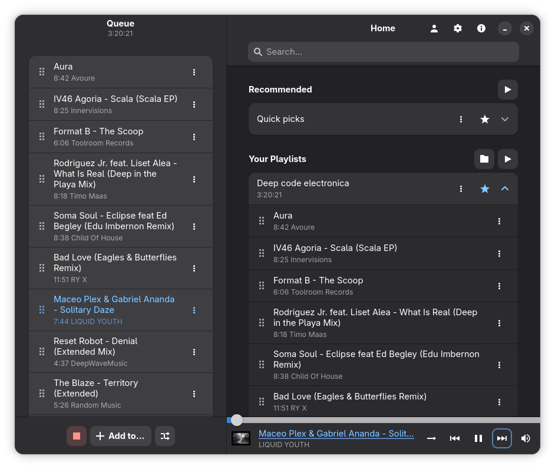

| [Install](https://zeh-kira.itch.io/monophony) | [Contribute](CONTRIBUTING.md) | [Donate](https://zeh-kira.itch.io/monophony/purchase) | [Documentation](docs/INDEX.md)
|-|-|-|-|

Monophony allows you to stream and download music from YouTube Music without ads, as well as create and import playlists without signing in.

**There are no plans for any significant changes or additional features in the future. Only basic maintenance will be performed.**

**Copyright** © Zehkira and contributors, [0BSD](LICENSE) license. Information about dependency licenses is available in the app.

