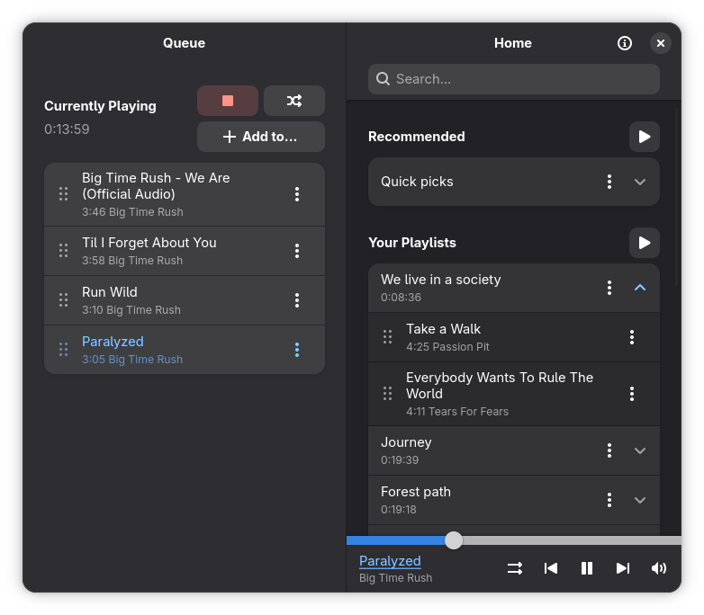
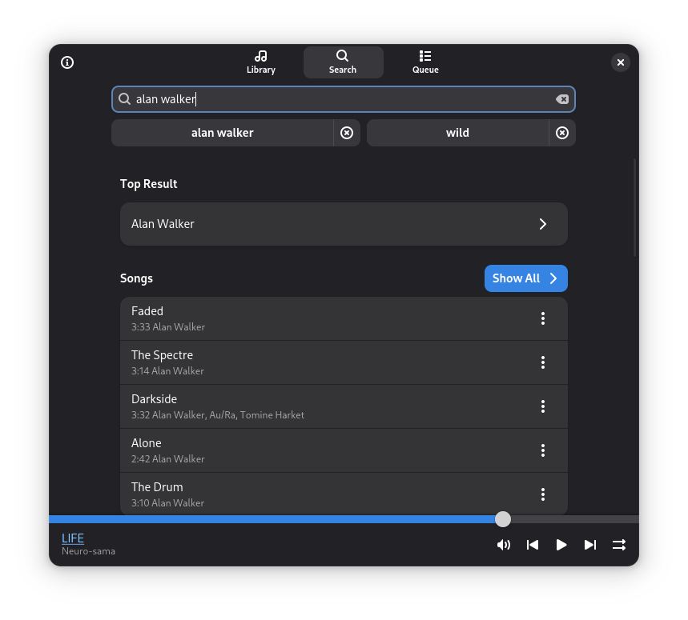
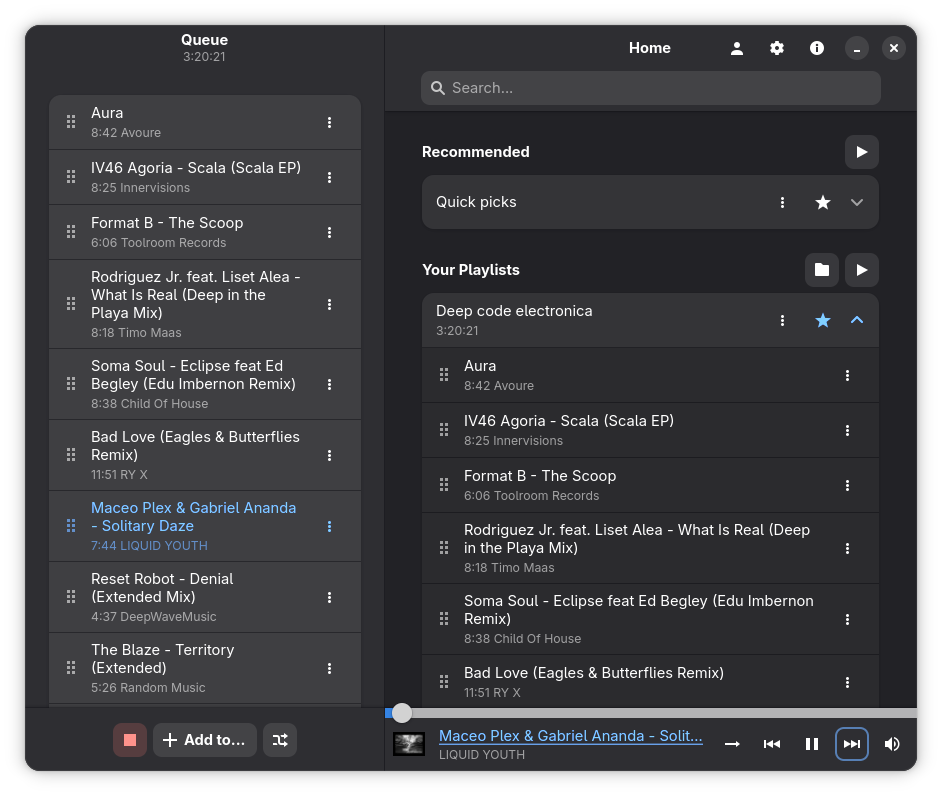

<p align="center">
  
</p>

<h1 align="center">Monophony</h1>

<p align="center">
  <b>A modern, ad-free YouTube Music client crafted with Python, GTK4, and Libadwaita for the Linux desktop.</b>
</p>

<p align="center">
  <a href="LICENSE"></a>
  <a href="https://www.gnu.org"></a>
  <a href="https://gitlab.gnome.org/GNOME/libadwaita"></a>
</p>

---

## 🌟 Overview

**Monophony** is an open-source, ad-free music streaming application that brings the full catalog of YouTube Music directly to your Linux desktop. Built natively with **GTK4** and **Libadwaita**, Monophony integrates seamlessly with the GNOME ecosystem while offering progressive streaming, gapless radio generation, bidirectional YouTube account sync, offline downloads, and system-wide GNOME search.

> [!NOTE]
> This project is an actively developed fork of the original [Monophony by Zehkira](https://gitlab.com/zehkira/monophony). It adds significant enhancements, including progressive audio streaming, bidirectional YouTube Music OAuth sync, endless radio mode, lyrics viewing, GNOME Shell search provider integration, and performance optimizations.

---

## ✨ Key Features

### ⚡ Progressive Streaming & Gapless Playback
- **Instant Playback**: Progressive audio streaming starts playback immediately without waiting for entire media files to buffer.
- **Intelligent Prefetching**: Background prefetching proactively extracts streaming URIs and buffers upcoming songs, providing seamless, gapless transitions between tracks.
- **Multi-Level Audio Cache**: Cached streams and extracted URIs are retained for recent and upcoming tracks, allowing instant backward and forward seeking without re-fetching.
- **Priority-Driven Scheduling**: Foreground user actions (searching, pressing play) automatically preempt and pause background tasks (prefetching, sync), ensuring a silky-smooth, lag-free UI at all times.

---

### 📻 YouTube Radio & Endless Discovery
- **Endless Radio from Anything**: Launch a dynamic radio station instantly from any song, artist, or playlist.
- **Seamless Queue Infill**: As playback nears the end of the queue, Monophony fetches fresh recommendations in the background and populates the queue without interrupting audio.
- **Smart Loop Prevention**: Deduplicates tracks and prevents repeating recently played songs in continuous radio mode.

---

### 🔄 YouTube Music Account & Two-Way Sync
- **OAuth Authentication**: Sign in effortlessly using standard Google / YouTube Music TV/device authorization, or import your existing `oauth.json` credentials.
- **Bi-Directional Playlist Sync**: Changes made locally (creating playlists, adding/removing tracks, reordering) synchronize back to YouTube Music via TVHTML5 and YouTube Data API v3 integrations.
- **Liked Songs (LM) Integration**: Full two-way support for your YouTube Music "Liked Songs" library. Like and unlike tracks directly in the player to update your library across devices.
- **Favorite Playlists**: Pin and organize your favorite playlists front and center.
- **No Song Caps**: Robust WEB_REMIX scrapers bypass default 15-song limits to fetch complete, large playlists.

---

### 🔍 GNOME Shell Overview Search Provider
- **Native GNOME Search**: Search Monophony directly from the GNOME Shell overview by pressing the `Super` key and typing your query.
- **Rich Suggestions**: Displays instant interactive suggestions for songs, albums, and playlists right in the desktop overview.
- **One-Click Playback**:
  - Selecting a song begins playback immediately.
  - Selecting an album or playlist loads and starts the collection.
- **Headless D-Bus Daemon**: Runs via an independent background service (`monophony-search-provider`), activating the player on demand with minimal system overhead.

---

### 🎤 Integrated Lyrics Viewer
- **Instant Lyrics Access**: Open the dedicated lyrics viewer with a single click from the bottom player bar or the queue sidebar.
- **Synchronized & Plain Text**: Automatically fetches and formats synchronized or static lyrics directly from YouTube Music for the currently playing track.

---

### 💾 Offline Downloads & Library Management
- **Download Tracks & Playlists**: Download your favorite songs or full albums/playlists to your local storage for offline playback.
- **Offline-First Playback**: Automatically detects downloaded tracks and plays them directly from local disk with zero network bandwidth.
- **Local Playlists**: Create, edit, and organize custom local playlists without requiring a Google account.

---

### 🎨 Native Desktop Integration & Libadwaita Design
- **Modern GNOME Styling**: Clean, adaptive interface compliant with GNOME Human Interface Guidelines (HIG), supporting both light and dark themes.
- **Responsive Layout**: Adapts gracefully across desktop monitors, laptops, and mobile Linux devices (Purism Librem 5, PinePhone).
- **Full MPRIS2 Support**: Control playback, seek, adjust volume, and view high-resolution album artwork via GNOME Quick Settings, lock screen, and keyboard media keys.
- **Background Playback**: Closing the window keeps audio playing in the background; easily restore the window or exit via the dedicated quit control.
- **In-App Log Viewer**: Built-in diagnostic console (`LogWindow`) accessible from the information menu for real-time logging inspection and troubleshooting.
- **Rich Album Artwork**: High-resolution thumbnail caching displays crisp cover art in track rows, search results, and the player bar.

---

## 🔐 Setting up YouTube Music OAuth (Google Cloud)

To enable **two-way playlist synchronization** and access your **Liked Songs** library, Monophony uses Google OAuth 2.0 (Device Authorization Flow). 

Follow these steps to create your own Google Cloud OAuth credentials:

### 1. Create a Google Cloud Project
1. Open the [Google Cloud Console](https://console.cloud.google.com/).
2. Click the project dropdown at the top of the page and select **New Project**.
3. Enter a project name (e.g., `Monophony`) and click **Create**.
4. Make sure your newly created project is selected in the top bar.

### 2. Enable the YouTube Data API v3
1. In the left navigation menu, go to **APIs & Services** → **Library**.
2. Search for **YouTube Data API v3**.
3. Select it from the results and click **Enable**.

### 3. Configure the OAuth Consent Screen & Publish the App
1. In the left navigation menu, go to **APIs & Services** → **OAuth consent screen**.
2. Choose **External** for the user type and click **Create**.
3. Fill in the required fields:
   - **App name**: `Monophony`
   - **User support email**: Your Gmail address
   - **Developer contact information**: Your Gmail address
4. Click **Save and Continue** past the *Scopes* and *Test users* steps.

> [!TIP]
> ### ⚠️ Critical: Publish the App to Prevent Weekly Token Expiration
> By default, Google Cloud creates new OAuth apps in **Testing** status. In testing mode, **Google automatically revokes refresh tokens after 7 days**, requiring you to re-authenticate every week.
> 
> To ensure your login remains permanent:
> 1. Go to **APIs & Services** → **OAuth consent screen**.
> 2. Under **Publishing status**, click **Publish App** and confirm.
> 3. The status will update to **In production**.
> 
> *Note*: You **do not** need to submit your app for Google verification review. Because this is your private OAuth app used solely by your own Google account, you can proceed without verification.

### 4. Create OAuth Client Credentials
1. In the left menu, select **APIs & Services** → **Credentials**.
2. Click **Create Credentials** at the top and choose **OAuth client ID**.
3. Under **Application type**, select **TVs and Limited Input devices**.
4. Set a name (e.g., `Monophony Device Client`) and click **Create**.
5. Copy the generated **Client ID** and **Client Secret** (or download the JSON file).

### 5. Sign In from Monophony
1. Launch Monophony and open the menu → **Account** (or click the profile icon).
2. Paste your **Client ID** and **Client Secret** into the fields (or click **Import oauth.json File...** to select your downloaded credentials JSON).
3. Click **Connect**.
4. Monophony will display a short code and a direct link to [`https://www.google.com/device`](https://www.google.com/device).
5. Open the link in your web browser, enter the code, sign in with your Google account, and grant access. *(If Google displays an "App not verified" warning, click "Advanced" → "Go to Monophony (unsafe)" to continue)*.
6. Return to Monophony and click **Confirm** to complete the login.

Your credentials will be saved in `~/.config/monophony/oauth.json`, and your playlists will automatically stay in sync across devices!

---

## 📸 Screenshots

<p align="center">
  
  
</p>

<p align="center">
  
</p>

---

## ⌨️ Command-Line Interface

Monophony supports extensive command-line parameters for scripting, launchers, and external automations:

```bash
# Launch Monophony and search for a query
monophony --search "Daft Punk"

# Play a specific song by YouTube ID
monophony --play-song "k4V3Mo61fJM" --title "Song Title" --artist "Artist Name"

# Play a playlist or album by ID
monophony --play-group "RDCLAK5uy_k..."

# Pass search query directly as arguments
monophony Radiohead Creep
```

---

## 🛠️ Building & Installation

### Requirements
- **Python** 3.10+
- **GTK4** & **Libadwaita** 1.4+
- **GStreamer** 1.0 (with good, bad, and ugly plugins)
- **yt-dlp**
- **ytmusicapi**
- **logboth**

### Flatpak (Recommended)
You can build and test Monophony locally using `flatpak-builder`:

```bash
# Clone the repository
git clone https://github.com/valerio/monophony.git
cd monophony/source

# Build and install Flatpak
make flatpak
```

### Running from Source
```bash
cd source
pip3 install -r requirements-dev.txt
PYTHONPATH=. python3 bin/monophony.py
```

### Running Test Suite
```bash
# Within the Flatpak environment:
flatpak run --command=python3 --filesystem=$(pwd) io.gitlab.zehkira.Monophony -m unittest source/tests/tests.py
```

---

## 📁 Configuration & Paths

Monophony stores its user data and configuration according to XDG specifications:
- **Configuration & Playlists**: `~/.config/monophony/`
  - `settings.json`: General preferences and streaming settings
  - `playlists.json`: Local and synced playlist definitions
  - `oauth.json`: Google / YouTube Music OAuth credentials (when logged in)
- **Cache**: `~/.cache/monophony/` (album art thumbnails, cached stream URIs)
- **Downloads**: `~/Music/` (configurable in settings)

---

## 📜 License & Acknowledgments

This project is a fork of the original [Monophony](https://gitlab.com/zehkira/monophony) created by **Zehkira** and contributors.

Monophony is free software licensed under the **[0BSD License](LICENSE)** (Zero-Clause BSD). You are free to use, modify, and distribute it for any purpose.

Third-party dependencies and libraries retain their respective licenses (inspectable within the app via *Information → Licenses*).
